<div align="center">

# DocFlow

### Human-in-the-loop invoice intelligence for Microsoft Dynamics 365 Business Central

DocFlow turns supplier PDF bundles into reviewed, traceable ERP transactions—combining fast local extraction, OCR fallback, vendor-aware reconciliation, and guarded Business Central writeback in one production workflow.

<p>
  
  
  
  
  
  
</p>

[Overview](#overview) · [Product tour](#product-tour) · [Architecture](#architecture) · [Engineering](#engineering-highlights) · [Setup](#local-development)

</div>

> [!NOTE]
> Conceived, architected, shipped, and supported end-to-end by a sole developer—from problem discovery and vendor reverse-engineering to Business Central integration and Debian deployment. The production workflow reduced manual invoice-entry time by **at least 80%**.

## Overview

| Supplier coverage | Workflow coverage | Production impact | Automation model |
|:---:|:---:|:---:|:---:|
| **6 suppliers** | **8 document workflows** | **≥80% less manual entry** | **Human-in-the-loop** |

Invoice automation becomes difficult when every supplier expresses the same business facts differently. A purchase can arrive as a searchable invoice, a scanned packing list, a quality certificate, or a multi-file bundle—with inconsistent descriptions, duplicated lots, and purchase orders that may already be archived.

DocFlow handles that variability as an engineering problem rather than a single OCR call:

1. **Extract cheaply first.** PyMuPDF reads native PDF text whenever the document has a usable text layer.
2. **Escalate only when needed.** Low-text or scanned pages fall back to Azure AI Document Intelligence in supported workflows.
3. **Apply supplier context.** Dedicated adapters reconcile invoices, packing lists, analysis reports, and quality data.
4. **Match conservatively.** Normalized tokens, vendor-aware scoring, active and archived PO searches, and explicit tie rejection prevent silent guesses.
5. **Keep a person in control.** Users review and edit extracted fields before any ERP write.
6. **Write back safely.** Authenticated REST/OData calls create invoices and lots, attach source documents, and update supported operational fields.

## Product tour

### 1. Select a workflow and upload the document bundle

<p align="center">
  
</p>

### 2. Review, correct, and approve extracted ERP lines

<p align="center">
  
</p>

The review surface deliberately exposes ERP item/resource mappings, quantities, costs, and calculated totals before submission. Low-confidence or tied matches remain unresolved for a user instead of being auto-posted.

## Architecture

```mermaid
flowchart LR
    A["Supplier PDF bundle"] --> B{"Usable text layer?"}
    B -->|Yes| C["PyMuPDF extraction"]
    B -->|Scanned / low text| D["Azure AI Document Intelligence"]
    C --> E["Vendor-specific adapter"]
    D --> E

    E --> F["Normalize fields & aggregate duplicate lots"]
    F --> G["Active + archived purchase-order lookup"]
    G --> H{"Unique ERP match?"}
    H -->|Yes| I["Prefill review UI"]
    H -->|Tie / low confidence| J["Flag for manual resolution"]
    J --> I

    I --> K["User verifies & submits"]
    K --> L["Microsoft Entra ID + MSAL"]
    L --> M["Dynamics 365 Business Central"]
    M --> N["Invoices · lines · lots · PDF attachments · date updates"]

    E -. "method, pages, timing" .-> O["PostgreSQL telemetry"]
    L -. "serialized token cache" .-> O
```



### Request path

```text
Browser / Jinja2 UI
        │
        ▼
Flask orchestration layer
        │
        ├── PyMuPDF-first extraction
        ├── Azure AI OCR fallback
        ├── Vendor-specific parsers
        ├── Reconciliation and exception rules
        ├── PostgreSQL logging + MSAL cache
        └── Business Central REST/OData writeback
```

## Engineering highlights

| Layer | What was engineered |
|---|---|
| **Document intelligence** | A PyMuPDF-first pipeline with selective Azure AI Document Intelligence fallback for scanned and low-text PDFs. |
| **Supplier adapters** | Dedicated parsing and reconciliation logic for six suppliers across eight workflows, including multi-document invoice, packing, analysis, quality, and shipping scenarios. |
| **ERP reconciliation** | Normalized token comparison, vendor-aware fuzzy scoring, duplicate-lot aggregation, active/archived PO lookups, configurable thresholds, and explicit tie rejection. |
| **Human review** | Editable Jinja2/Bootstrap review screens that surface uncertain mappings and require confirmation before Business Central writes. |
| **ERP integration** | Business Central REST/OData integrations for purchase invoice headers and lines, lot creation, source-PDF attachment, and supported shipping-date updates. |
| **Identity** | Microsoft Entra ID authorization-code flow through MSAL, eight-hour Flask sessions, silent refresh, and PostgreSQL-backed serialized token caching. |
| **Reliability** | OData-safe input quoting, payload normalization, Business Central error propagation, ETag-based conflict handling with one refetch/retry, best-effort temporary-file cleanup, and timing telemetry. |
| **Operations** | PostgreSQL processing logs capture vendor, document, extraction method, page counts, and lifetime OCR/text usage statistics for troubleshooting. |

## Supplier and workflow coverage

| Supplier | Workflow |
|---|---|
| **Sakata** | Invoice and lot/quality reconciliation |
| **HM Clause** | Invoice and supporting-document reconciliation |
| **Seminis** | Invoice, packing, and analysis-document reconciliation |
| **Nunhems** | Multi-document invoice, packing, germination, and quality reconciliation |
| **Syngenta** | Invoice extraction with page-level OCR support and ERP matching |
| **Kamterter** | Canada invoice creation and source-PDF attachment |
| **Kamterter** | Allowlisted US invoice workflow |
| **Kamterter** | Shipping-report workflow with ETag-aware estimated-date updates |

## Guardrails for ERP automation

- **No automatic guess on ties:** equal top scores return no match and stay in the review workflow.
- **Human approval before writeback:** extracted and reconciled values remain editable until submission.
- **Allowlisted destinations:** Canada and US Business Central targets are resolved from server-side configuration rather than browser-supplied URLs.
- **Optimistic-concurrency handling:** stale ETags trigger one controlled refetch and retry instead of overwriting newer data.
- **Actionable failures:** downstream Business Central messages and HTTP status codes are propagated to the UI/logs.
- **Cost-aware extraction:** native PDF text is preferred; OCR is used only when a supported workflow needs it.
- **Operational visibility:** extraction method, pages processed, timing, and recent activity are retained for diagnosis.

## Technology stack

| Area | Technologies |
|---|---|
| **Backend** | Python, Flask, Werkzeug |
| **Document processing** | PyMuPDF, Azure AI Document Intelligence |
| **ERP and identity** | Dynamics 365 Business Central, REST, OData V4, Microsoft Entra ID, MSAL/OAuth 2.0 |
| **Data** | PostgreSQL, psycopg2, pandas, openpyxl |
| **Frontend** | Jinja2, JavaScript, Bootstrap, HTML/CSS |
| **Platform** | Debian/Linux |

## Repository structure

```text
invoice-ocr/
├── app.py                    # Flask routes, auth, reconciliation, and BC orchestration
├── db_logger.py              # Processing telemetry and lifetime statistics
├── vendor_extractors/        # Supplier-specific parsers and document pipelines
│   ├── hm_clause.py
│   ├── kamterter.py
│   ├── kamterter_shipping.py
│   ├── kamterter_us.py
│   ├── nunhems.py
│   ├── sakata.py
│   ├── seminis.py
│   └── syngenta.py
├── templates/                # Upload, review, logs, and authentication views
├── static/                   # Application branding and browser assets
├── test_bc_post.py           # Manual Business Central integration smoke test
└── requirements.txt
```

## Local development

> [!IMPORTANT]
> This is an organization-specific integration, not a standalone OCR demo. Running it requires an Entra tenant, Azure AI Document Intelligence, PostgreSQL, a Business Central environment, and the custom AL API/OData objects expected by the application.

### Prerequisites

- Python **3.10+**
- PostgreSQL
- An Azure AI Document Intelligence resource
- A Microsoft Entra app registration with an authorized local redirect URI
- A Dynamics 365 Business Central environment with the required custom API pages and OData web services

### 1. Clone and install

```bash
git clone https://github.com/privo211/invoice-ocr.git
cd invoice-ocr

python3 -m venv venv
source venv/bin/activate
python -m pip install --upgrade pip
python -m pip install -r requirements.txt
```

### 2. Configure the application

Create a local `.env` file. Never commit live credentials.

```dotenv
SECRET_KEY=<long-random-value>

AZURE_TENANT_ID=<entra-tenant-id>
AZURE_CLIENT_ID=<entra-application-id>
AZURE_CLIENT_SECRET=<entra-client-secret>

# Keep the trailing slash.
AZURE_ENDPOINT=https://<document-intelligence-resource>.cognitiveservices.azure.com/
AZURE_KEY=<document-intelligence-key>

BC_COMPANY=<url-encoded-company-name>
BC_ENV=<business-central-environment>

# Optional second allowlisted target.
BC_US_ENV=<us-business-central-environment>
BC_US_COMPANY=<us-company-name>
```

Register this development redirect URI in Microsoft Entra ID:

```text
http://localhost:5001/auth/callback
```

Configure PostgreSQL for the application and ensure the runtime identity can create/use the processing tables. Production credentials should be supplied through environment variables or a secret manager—not source control.

The application manages its processing-log and lifetime-statistics tables. Its MSAL cache additionally expects a table compatible with:

```sql
CREATE TABLE IF NOT EXISTS msal_token_cache (
    user_name TEXT PRIMARY KEY,
    token_cache_data TEXT NOT NULL,
    updated_at TIMESTAMP NOT NULL DEFAULT CURRENT_TIMESTAMP
);
```

### 3. Start the development server

Using the Flask CLI ensures `.env` is loaded before the application is imported:

```bash
flask --app app run --host 0.0.0.0 --port 5001
```

Open [http://localhost:5001](http://localhost:5001).

<details>
<summary><strong>Required Business Central surfaces</strong></summary>

The application expects organization-specific API pages, queries, or published OData web services including:

- `PVORA/VendorInvoiceAutomation/v2.0/PurchaseHeaders`
- `PVORA/VendorInvoiceAutomation/v2.0/PurchaseLines`
- `PurchaseOrderQuery`
- `ArchivePurchaseOrderQuery`
- `Items` and `FilteredItems`
- `Package_Descriptions_List_Excel`
- `Lot_Treatments_Card_Excel`
- `Lot_Treatments_Card_2_Excel`
- `Lot_Info_Card`
- `Assembly_Order_Excel`

Their schemas and permissions must match the fields used by the Flask integration.

</details>

### Integration-test warning

> [!CAUTION]
> `test_bc_post.py` is a **live integration smoke test**, not an isolated unit test. It sends a write request to the configured Business Central sandbox. Review its environment and payload before running it, and never point it at production.

## Production deployment

The application was deployed and supported on Debian. For a new production deployment:

- run Flask behind a production WSGI server and TLS-terminating reverse proxy;
- keep Entra, Azure AI, PostgreSQL, and Flask secrets outside the repository;
- grant the Entra identity only the Business Central permissions it requires;
- use separate, explicit environment/company configuration for Canada and US targets;
- back up PostgreSQL token and telemetry data according to organizational policy;
- monitor application timing logs, OCR usage, API failures, and ETag conflicts.

## Design principles

1. **Prefer deterministic extraction over unnecessary OCR.** It is faster, cheaper, and easier to debug.
2. **Model supplier differences explicitly.** Vendor adapters keep special cases isolated and testable.
3. **Treat ambiguity as a workflow state.** A missing suggestion is safer than a confident-looking wrong one.
4. **Keep people at the approval boundary.** Automation prepares ERP work; a user authorizes it.
5. **Propagate operational context.** Errors, methods, timing, and page counts should be visible enough to support production.

## Project ownership

DocFlow was conceived, architected, implemented, deployed, and supported by **[Priyanshu Vora](https://github.com/privo211)** as the sole developer. The work covered problem discovery, document reverse-engineering, OCR strategy, reconciliation algorithms, identity, custom Business Central integrations, user experience, data persistence, deployment, and ongoing support.

<div align="center">

### Explore more

[Portfolio](https://privo211.github.io/priyanshu-portfolio) · [Source code](https://github.com/privo211/invoice-ocr) · [GitHub profile](https://github.com/privo211)

<sub>Built to turn messy supplier documents into controlled, reviewable ERP actions.</sub>

</div>
